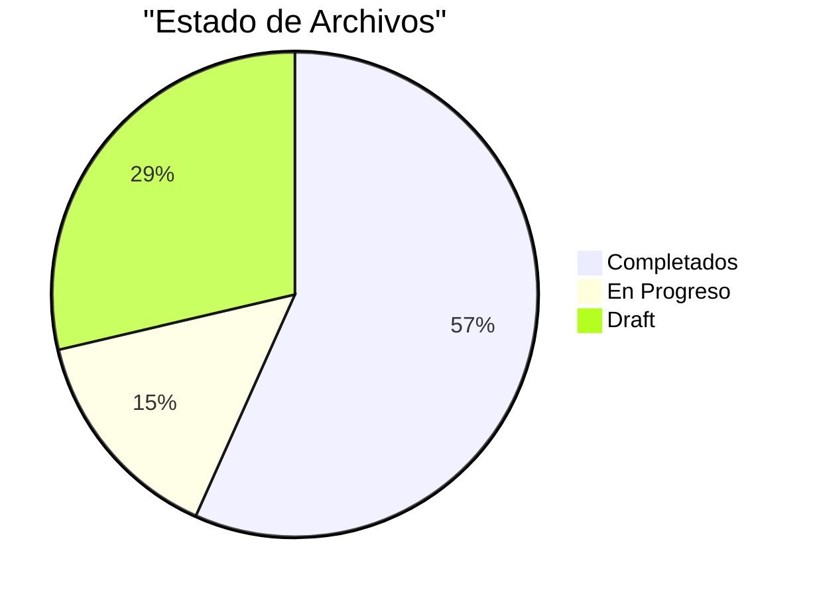

# Comando: sphinx-analyze-progress

Analiza el progreso de traduccion/documentacion del proyecto o de un libro especifico.

## Uso

```
sphinx-analyze-progress [opciones]
```

## Opciones

**--book <nombre>**
- Analizar libro especifico en biblioteca/
- Ejemplo: --book arc42
- Si no especificado: analiza proyecto completo

**--section <ruta>**
- Analizar seccion especifica
- Ejemplo: --section source/biblioteca/ingenieria/sistemas/arquitectura/arc42_documentationsections/02_constraints/
- Requiere que --book tambien este especificado

**--format <formato>**
- Formato de output
- Valores: terminal | markdown | json
- Default: terminal

**--output <archivo>**
- Guardar reporte en archivo
- Ejemplo: --output progress_report.md
- Formato detectado por extension

**--detailed**
- Incluir analisis detallado archivo por archivo
- Flag boolean

## Proceso

### 1. Escaneo de Estructura

DETECTAR:
- Archivos .rst y .md
- Directorios de contenido
- Metadata de archivos
- Estado de completitud

PARA PROYECTO COMPLETO:
```
source/
+-- 01_fundamentos/ -> Escanear
+-- 02_procedimientos/ -> Escanear
+-- ...
+-- 10_apendices/ -> Escanear
+-- biblioteca/ -> Escanear
+-- diataxis/ -> Escanear
```

PARA LIBRO ESPECIFICO:
```
source/biblioteca/ingenieria/sistemas/arquitectura/arc42_documentation
+-- sections/
| +-- 01_introduction_goals/ -> Escanear
| +-- 02_constraints/ -> Escanear
| +-- ...
```

### 2. Analisis de Metadata

POR CADA ARCHIVO:
- Leer metadata si existe
- Detectar estado (draft, published, etc)
- Contar palabras
- Detectar profundidad de headings

PARSEAR METADATA:
```rst
:Estado: Draft | Published | In Progress
:Completitud: 0-100%
:Autor: [Nombre]
:Fecha: YYYY-MM-DD
```

### 3. Calculo de Metricas

METRICAS GLOBALES:
- Total archivos
- Archivos completados vs draft
- Total palabras
- Promedio palabras por archivo
- Profundidad promedio

METRICAS POR CAPITULO/LIBRO:
- Progreso por seccion
- Archivos por seccion
- Estado de traduccion

METRICAS DE CALIDAD:
- Metadata coverage (% archivos con metadata)
- Build success rate
- Enlaces rotos

### 4. Generacion de Reporte

#### Formato: terminal

```
===============================================
ANALISIS DE PROGRESO - ADT Documentation
===============================================

Fecha: YYYY-MM-DD HH:MM
Alcance: Proyecto Completo

RESUMEN GENERAL
-----------------------------------------------

Total Archivos: 157
Completados: 89 (57%)
En Progreso: 23 (15%)
Draft: 45 (28%)

Total Palabras: 45,230
Promedio por Archivo: 288 palabras

PROGRESO POR CAPITULO
-----------------------------------------------

Capitulo Archivos Estado %
------------------------------------------------
01. Fundamentos 12/15 En Progreso 80%
02. Procedimientos 8/10 En Progreso 80%
03. Estandares 5/8 Draft 63%
...
10. Apendices 7/7 Completado 100%

Biblioteca 45/120 En Progreso 38%
 arc42 12/12 Completado 100%
 otros 33/108 En Progreso 31%

METRICAS DE CALIDAD
-----------------------------------------------

Metadata Coverage: 87% (137/157 archivos)
Build Success: 100%
Enlaces Rotos: 0
Warnings: 12

ESTIMACION
-----------------------------------------------

Trabajo Completado: 57%
Archivos Restantes: 68
Estimacion: ~85 horas de trabajo restante
 (Basado en promedio de 1.25 horas por archivo)

TOP PRIORIDADES
-----------------------------------------------

1. Completar Capitulo 03 (Estandares) - 3 archivos
2. Metadata faltante en 20 archivos
3. Biblioteca/otros - 75 archivos pendientes

ACCIONES SUGERIDAS
-----------------------------------------------

1. Agregar metadata a archivos sin ella
2. Convertir drafts en progress a completados
3. Priorizar biblioteca/otros para siguiente sprint
```

#### Formato: markdown

```markdown
# Progreso del Proyecto ADT

Fecha: YYYY-MM-DD HH:MM
Alcance: Proyecto Completo

## Resumen

| Metrica | Valor |
|---------|-------|
| Total Archivos | 157 |
| Completados | 89 (57%) |
| En Progreso | 23 (15%) |
| Draft | 45 (28%) |

## Progreso por Capitulo

| Capitulo | Archivos | Estado | Progreso |
|----------|----------|--------|----------|
| 01. Fundamentos | 12/15 | En Progreso | 80% |
| 02. Procedimientos | 8/10 | En Progreso | 80% |
...

## Graficos



## Recomendaciones

1. Completar Capitulo 03 (3 archivos pendientes)
2. Agregar metadata a 20 archivos
3. Priorizar biblioteca/otros
```

#### Formato: json

```json
{
 "fecha": "YYYY-MM-DD HH:MM",
 "alcance": "proyecto_completo",
 "resumen": {
 "total_archivos": 157,
 "completados": 89,
 "en_progreso": 23,
 "draft": 45,
 "porcentaje_completitud": 57
 },
 "capitulos": [
 {
 "numero": "01",
 "nombre": "Fundamentos",
 "archivos_completados": 12,
 "archivos_total": 15,
 "porcentaje": 80,
 "estado": "en_progreso"
 },
 ...
 ],
 "metricas": {
 "total_palabras": 45230,
 "promedio_palabras": 288,
 "metadata_coverage": 87,
 "build_success_rate": 100,
 "enlaces_rotos": 0
 },
 "estimacion": {
 "trabajo_completado_pct": 57,
 "archivos_restantes": 68,
 "horas_estimadas": 85
 }
}
```

## Ejemplos

### Ejemplo 1: Proyecto Completo

```bash
sphinx-analyze-progress
```

Analiza todo el proyecto y muestra en terminal.

### Ejemplo 2: Libro Especifico

```bash
sphinx-analyze-progress --book arc42
```

Output:
```
ANALISIS - arc42 Documentation

Total Secciones: 12
Completadas: 12 (100%)
En Progreso: 0
Pendientes: 0

Seccion Estado Archivos
------------------------------------------------------
01. Introduction and Goals Completado 5/5
02. Constraints Completado 6/6
03. Context and Scope Completado 4/4
...
12. Glossary Completado 3/3

PROGRESO: 100% [OK]

arc42 esta completamente traducido.
```

### Ejemplo 3: Seccion Especifica

```bash
sphinx-analyze-progress \
 --book arc42 \
 --section source/biblioteca/ingenieria/sistemas/arquitectura/arc42_documentationsections/02_constraints/
```

Output:
```
ANALISIS - arc42 Section 02: Constraints

Archivos Originales: 6
Archivos Traducidos: 6
Metadata: Completa
Build: Exitoso

ARCHIVOS:
- intro.rst - Completado (2026-01-28)
- restricciones_organizacionales.rst - Completado
- restricciones_tecnicas.rst - Completado
...

ESTADO: Completado [OK]
```

### Ejemplo 4: Reporte Markdown

```bash
sphinx-analyze-progress \
 --book arc42 \
 --format markdown \
 --output arc42_progress.md
```

Genera archivo arc42_progress.md con reporte completo.

### Ejemplo 5: Analisis Detallado JSON

```bash
sphinx-analyze-progress \
 --format json \
 --detailed \
 --output progress_detailed.json
```

Genera JSON con informacion archivo por archivo.

## Algoritmo de Deteccion de Estado

### Por Metadata Explicita

```rst
:Estado: Draft
```
-> Estado: Draft

### Por Heuristica

SI archivo tiene:
- Metadata completa
- > 100 palabras
- Sin TODOs

-> Estado: Completado

SI archivo tiene:
- Metadata parcial
- > 50 palabras
- Headings completos

-> Estado: En Progreso

SI archivo tiene:
- Sin metadata
- < 50 palabras
- O solo headings

-> Estado: Draft

## Calculo de Estimaciones

```
Horas Estimadas = Archivos Restantes × Tiempo Promedio por Archivo

Tiempo Promedio = {
 Draft -> 1.5 horas (nuevo contenido)
 En Progreso -> 0.5 horas (completar)
 Metadata faltante -> 0.25 horas (agregar)
}
```

## Integracion con Scripts

PUEDE USAR:
- `scripts/progreso_libro.sh` (si existe)
- `scripts/analizar_seccion.py` (para secciones)

COMPLEMENTA CON:
- Parseo de metadata
- Conteo de palabras
- Analisis de estructura

## Casos de Uso

### Planificacion de Sprint

```bash
sphinx-analyze-progress --format markdown --output sprint_plan.md
```

Usar reporte para identificar prioridades del siguiente sprint.

### Tracking de Proyecto

```bash
# Ejecutar semanalmente
sphinx-analyze-progress --format json --output "progress_$(date +%F).json"

# Comparar progreso
diff progress_2026-01-21.json progress_2026-01-28.json
```

### Reporte a Stakeholders

```bash
sphinx-analyze-progress \
 --format markdown \
 --output reporte_stakeholders.md
```

Enviar reporte_stakeholders.md a stakeholders.

## Metricas Adicionales

Con --detailed:

- Palabras por capitulo
- Archivos por autor (si metadata tiene autor)
- Velocidad de progreso (comparando con historico)
- Distribucion de profundidad de headings
- Cobertura de cross-references

## Troubleshooting

**"No metadata found"**
- Archivos sin metadata se cuentan como draft
- Agregar metadata minima para mejor tracking

**"Build required for accurate stats"**
- Algunos stats requieren build exitoso
- Ejecutar: `make html` antes del analisis

**Estimaciones imprecisas**
- Basadas en heuristicas
- Ajustar factores segun experiencia del equipo

## Referencias

- scripts/progreso_libro.sh
- scripts/analizar_seccion.py
- Metadata format en source/docs_maestros/

## Notas

- Ejecutar periodicamente para tracking
- Comparar con versiones anteriores para ver velocidad
- Usar para identificar cuellos de botella
- Metadata completa mejora precision del analisis
- Formato JSON util para integracion con dashboards
